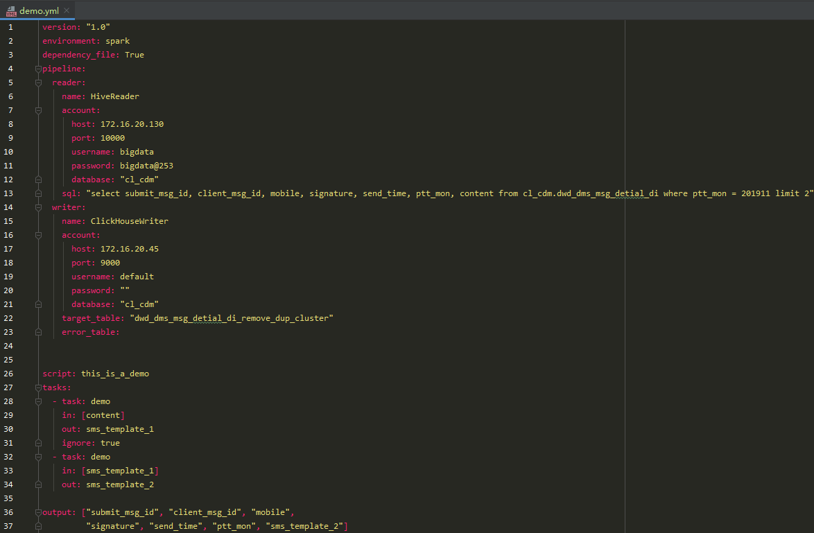
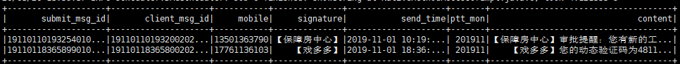
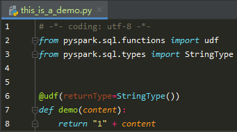

pipeline任务会依次执行yaml文件里面的script被指定的脚本里面的函数

完整的YAML文件：

在这个YAML文件里，你的输入包含这些字段

这是this_is_a_demo.py：

调用这个任务时，this_is_a_demo脚本下面的demo函数会被执行两次，第一次输入content字段，输出sms_template_1，

第二次输入sms_template_1，输出sms_template_2

这是处理完之后的样子：

字段处理是按YAML文件里面指定的函数顺序依次执行的（注：和this_is_a_demo.py脚本里的函数顺序无关）

处理字段的函数直接放到udf装饰器下面

最后，output里面被指定的字段会被保存插入表中，如果字段输出是1对多关系，那么以字典格式在函数里做dumps序列化处理，下次读入时loads反序列化即可

